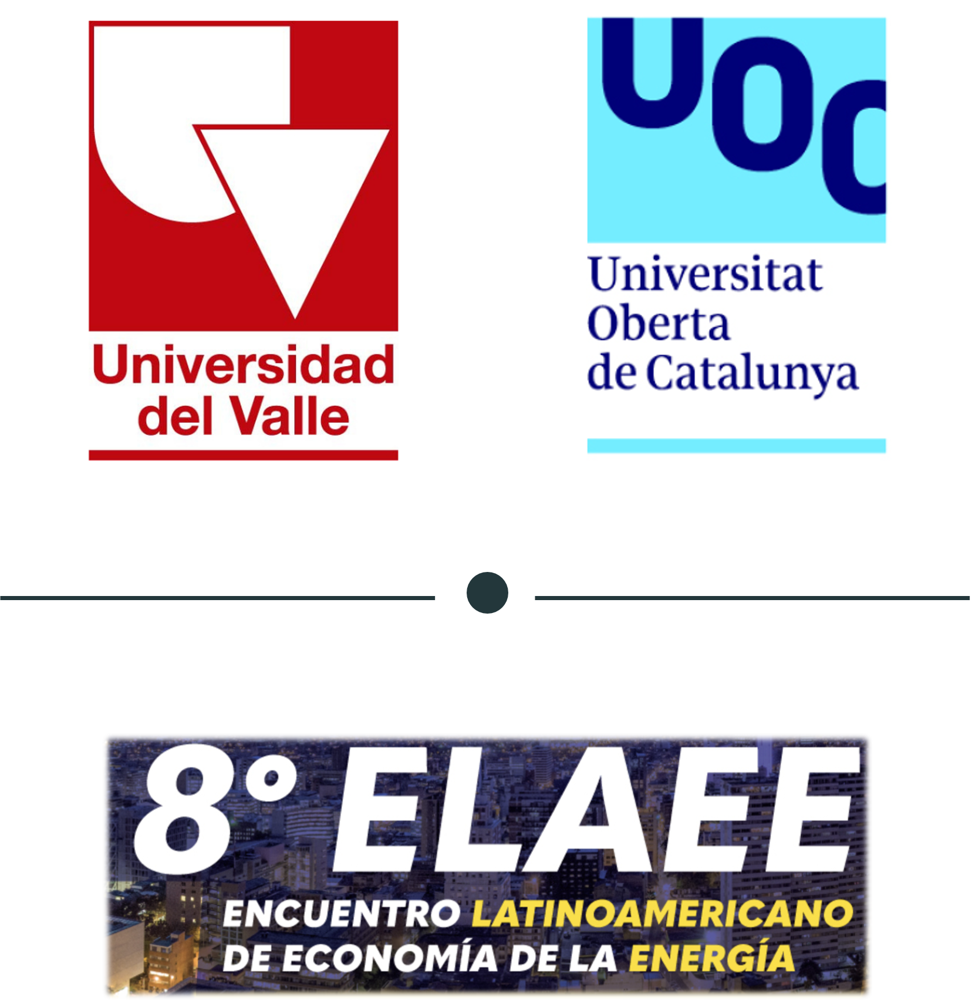
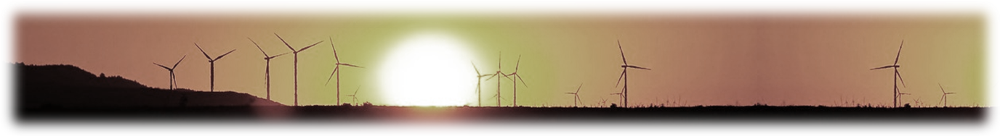
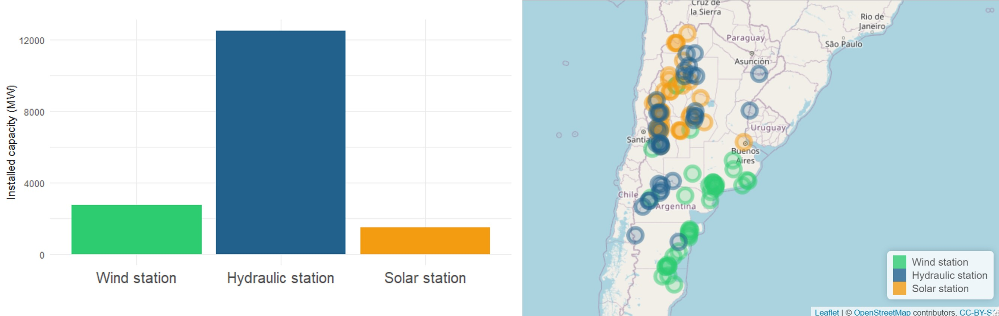
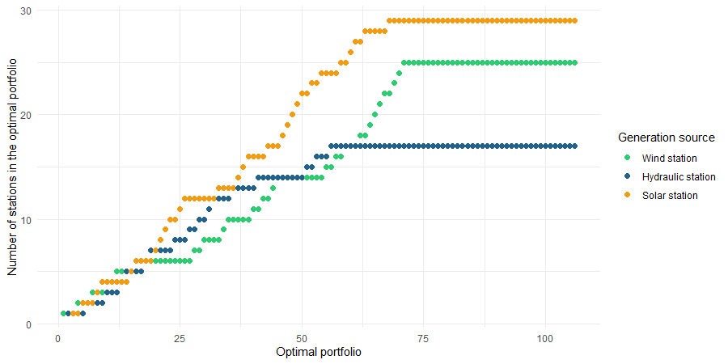
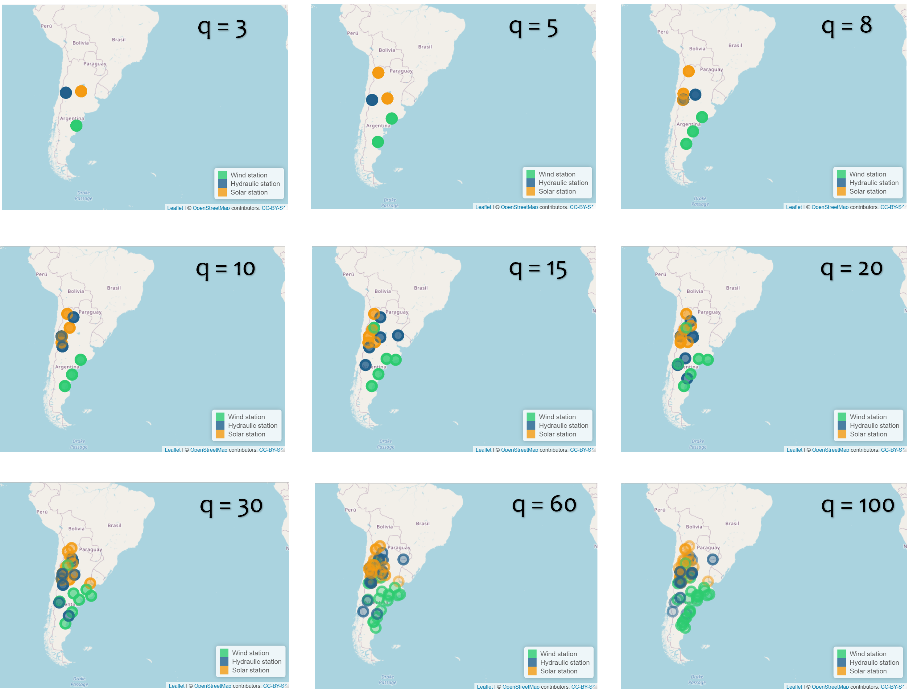
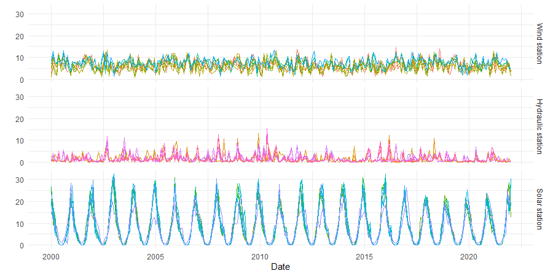
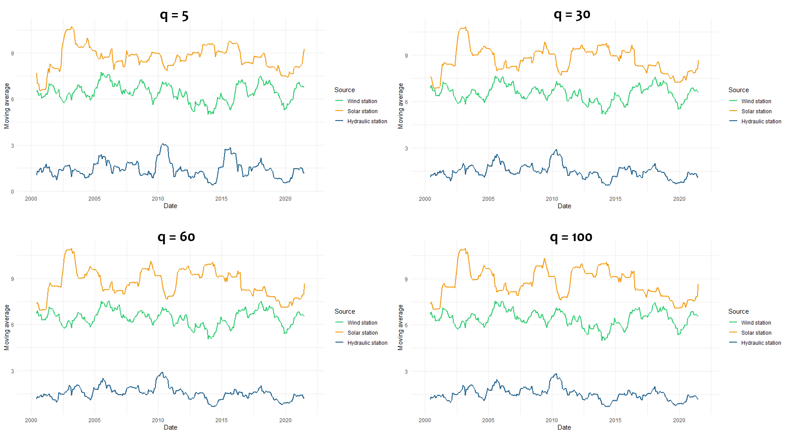

```{r setup, include=FALSE}
library(knitr)                              # paquete que trae funciones utiles para R Markdown
library(tidyverse)                          # paquete que trae varios paquetes comunes en el tidyverse
library(datos)                              # paquete que viene con datos populares traducidos al español :)
library(shiny)
library(fontawesome)
# opciones predeterminadas
knitr::opts_chunk$set(echo = FALSE,         # FALSE: los bloques de código NO se muestran
                      dpi = 300,            # asegura gráficos de alta resolución
                      warning = FALSE,      # los mensajes de advertencia NO se muestran
                      error = FALSE)        # los mensajes de error NO se muestran


options(htmltools.dir.version = FALSE)

```

```{r xaringan-panelset, echo=FALSE}
xaringanExtra::use_panelset()
xaringanExtra::use_share_again()
```


class: clear


.pull-left[

.center[

<br><br>

```{r echo=FALSE, out.width = "75%" }

```

]
]


.pull-right[


.center[


[Orlando Joaqui-Barandica, M.Sc.](https://www.joaquibarandica.com) <br/>
Universidad del Valle
]


.center[


[Diego F. Manotas-Duque, Ph.D.](http://industrial.univalle.edu.co/profesores/diego-fernando-manotas-duque) <br>
Universidad del Valle
]

.center[


[Jorge M. Uribe, Ph.D.](https://jorgemuribe.com/) <br>
Universitat Oberta de Catalunya
]

]


???

Buenas tardes, el día de hoy socializaré mi propuesta de investigación doctoral en tópicos de activos y pasivos: una visión comparativa entre economías emergentes y desarrolladas.

Esta propuesta doctoral está bajo la dirección del profesor Diego Manotas de la Escuela de Ing. Industrial de la Universidad del Valle. Y el profesor Jorge M. Uribe de la Universitat Oberta de Catalunya..

Este trabajo de investigación está integrado al grupo de investigación GIFINC de la Esc. de Ing. Ind.

---


name: Motivation
class: inverse, mline, center, middle


# Motivation

???


---


<div class="my-logo-right"></div>


# Motivation


.pull-left-narrow[


<br>
<br>
<br>

.center[

### Three fundamental characteristics of future energy markets are: 

]

]

.pull-right-wide[
.font110[.left[ 


<br>
<br>

> - Almost all electricity will be generated by variable renewable energy technologies (VRE) such as wind turbines and solar cells, and by hydropower sources.


<hr>


> - Further transnational integration of energy markets will be required with the aim of diversifying the climate and weather risk.


<hr>


> - Energy storage, especially green hydrogen technologies, will play a critical role.

]
]
]


---

<div class="my-logo-right"></div>


# Motivation

<br>

.left[

.font170[Literature has extensively explored `portfolio optimization techniques` similar to those developed from a capital allocation perspective in finance...

]
]


<br>

.right[
.font170[...to construct an optimal generation mix of electricity that consists of different renewable energy technologies `(wind, sun, hydro)` and diverse geographical locations to conduct the energy transformation.
]
]


---


name: Motivation
class: inverse, center, middle


# We consider a different although 
<br>
# related problem


.center[`r fontawesome::fa("lightbulb", height = "5em")`]

???


---

<div class="my-logo-right"></div>

# Motivation

<br>

.pull-left-narrow[

<br>
<br>

.center[`r fontawesome::fa("globe-americas", height = "7em")`]
]

.pull-right-wide[

.font120[
> We provide a way for a government to decide, in a globalized market of electricity:
- Which firms (and power plants) should be ideally preserved (and encourage) in case that specialization dictates concentrating the national generation efforts on a fixed number of firms (or a few locations), and therefore, on fewer power plants than those already in operation. 

]

]


<hr>
<br>


```{r fig6, fig.align="center", out.width="70%"}

```


---


name: Methodology

class: inverse, mline, center, middle


# Methodology and Data

???


---

<div class="my-logo-right"></div>


# Optimization model


.pull-left[

> `r anicon::faa("angle-double-right", animate = "passing")` We perform an optimization using the correlation matrix of observed weather configurations and progressively reducing the number of power plants that better preserve the actual weather/climate risk configuration.

<br>

$$ρ_{ij}: \text{Correlation between plant i and plant j}$$

$$x_{ij} = \left\{\begin{matrix}
1 & \text{if j is the most similar plant} \\
  & \text{in the optimal portfolio} \\
0 & otherwise 
\end{matrix}\right.$$


$$y_{j} = \left\{\begin{matrix}
1 & \text{if the plant j is selected} \\
  & \text{in the optimal portfolio} \\
0 & otherwise 
\end{matrix}\right.$$

]


.pull-right[


Objective function

$$Z=Max\ \ \sum_{i=1}^{n}\sum_{j=1}^{n}{\rho_{ij}x_{ij}}$$


Subject to:

- $$\sum_{j=1}^{n}y_j=q$$

- $$\sum_{j=1}^{n}x_{ij}=1\ \ \ \ \ \ \ \ \ \ \ \ \ \ for\ i=1,\ \ldots,n$$

- $$x_{ij}\le y_j$$

]


---


<div class="my-logo-right"></div>


# Data


.panelset[
.panel[.panel-name[Sources of energy generation]


<div style="line-height:5%;">
    <br>
</div>

<br>

```{r echo=FALSE, message=FALSE, warning=FALSE, out.height= "100%", out.width="100%"  }

library(datapasta)
library(gt)
library(tidyverse)
library(glue)


T2<-tibble::tribble(
 ~`Type`,                 ~`n = 106`,     ~`MW = 16,746 *`,
"Wind plants",                           "38",       "16.3%", 
"Solar plants",                          "34",        "9.0%",
"Hydraulic plants",                      "34",        "74.7%"
  )


T2 %>% 
  gt() %>% 
tab_header(
title = md("**Sources of energy generation in Argentina**")
)%>% 
  tab_source_note(
    source_note = "*These plants represent an installed power capacity of more than 16,747 MW"
  )
  


```

<br>

> `r anicon::faa("angle-double-right", animate = "passing")` We select the country of Argentina and use 106 main power generation plants that use different production technologies associated with wind, solar and hydraulic sources. 


]


.panel[.panel-name[Georeferencing of the generation sources]


<br>

```{r fig1, echo=FALSE, fig.align="center", out.width="80%"}

```


> `r anicon::faa("angle-double-right", animate = "passing")` We extract for each coordinate according to its type of generation, information on wind speed at 2m, solar irradiation (JM/m2) and precipitation (mm). Climate information is extracted from 01/01/2000 to 01/01/2022 with a daily frequency.


]
]

---


name: RyC

class: inverse, mline, center, middle


# Results and Conclusion

???


---

<div class="my-logo-right"></div>

# Results


<br>

```{r fig2, echo=FALSE, fig.align="center", out.width="70%"}

```

> `r anicon::faa("angle-double-right", animate = "passing")` Distribution of the number of plants for each optimal portfolio. **Note:** The axis of the optimal portfolio represents the number q of plants specialized in preserving the correlation structure of the energy network.


---


<div class="my-logo-right"></div>

# Results


<br>

```{r fig3, echo=FALSE, fig.align="center", out.width="48%"}

```

> `r anicon::faa("angle-double-right", animate = "passing")` Geographic distribution of plants optimally selected. **Note:** We select some values of q to identify as our model achieves in diversifying climatic variability from a geographic perspective.


---


<div class="my-logo-right"></div>

# Results


<br>

```{r fig4, echo=FALSE, fig.align="center", out.width="65%"}

```

> `r anicon::faa("angle-double-right", animate = "passing")` Averages of the meteorological series. **Note:** This figure shows the behavior of all the climatic series associated with an optimal portfolio with *q=30*. We use this value of *q* to exemplify the climatic variability of each type of source.


---


<div class="my-logo-right"></div>

# Results


<br>

```{r fig5, echo=FALSE, fig.align="center", out.width="65%"}

```

> `r anicon::faa("angle-double-right", animate = "passing")` 12 months Moving average for meteorological series. **Note:** This figure shows some optimal portfolio for *q = 5, 30, 60, 100,* where each series is the moving average of the set of meteorological series by generate source.


---


<div class="my-logo-right"></div>

# Conclusion


.left-column[

.font400[1.]

<br>
<br>
<br>
<br>


.font400[2.]

]

.right-column[
.font120[
> We adapt integer portfolio optimization tools from finance to show how a government can transit, if required, to a scenario of electricity generation based on renewable energy sources, and fewer power plants than those already operating in the country. 

<br>


<hr>

<br>


> The main objective of the government is to preserve the configuration of weather risks, which is determinant for variable renewable energy technologies, as stable as possible during such a transition. 

]
]


???


---


<div class="my-logo-right"></div>

# Conclusion


.left-column[

.font400[3.]

<br>
<br>

<br>
<br>


.font400[4.]

]

.right-column[
.font120[
> We resort to these fundamental weather factors and show that our model is able to provide the path that could be optimally transited during the transition to a more specialized electricity market in Argentina.

<br>


<hr>

<br>


> An extension would be to incorporate more than one country in the model, in order to directly target the problem of globalized markets, from a supranational perspective, instead of a restricted optimization problem that only concerns a single national unit. 

]
]


???


---


class: inverse, mline, center, bottom


<br>


.pull-left[

```{r qr, echo=FALSE, fig.align="center", out.width="50%"}
knitr::include_graphics("img/qr-code.png")
```

<br>
<br>
<br>

.center[
www.joaquibarandica.com
]

]


.pull-right[

<br>
<br>
<br>


# Gracias !!!

<br>
<br>


.font140[**|**] `r anicon::faa("envelope", animate = "passing")` orlando.joaqui@correounivalle.edu.co

.font140[**|**] `r anicon::faa("envelope", animate = "passing")` diego.manotas@correounivalle.edu.co

.font140[**|**] `r anicon::faa("envelope", animate = "passing")` juribeg@uoc.edu

<br>
<br>
<br>
<br>

]

???


